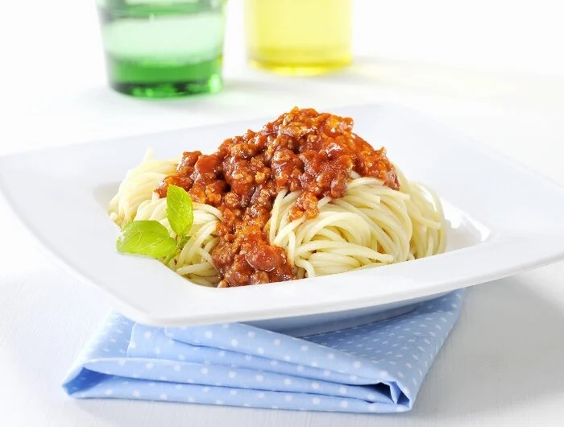

# Spaghetti Bolognese

Zutaten (_4 Portionen_)
 - 1 Zwiebel
 - 500g Hackfleisch
 - 1 EL Planzenöl
 - 1 EL Mehl
 - 750g Tomaten
 - Salz und Pfeffer
 - 1 TL Italienische Kräuter
 - 500g Spaghetti

 Zubereitung
 1. Zwiebel in kleine Stücke schneiden
 2. Zusammen mit Hackfleisch und Öl anbraten
 3. Mit Mehl bestreuen und Tomaten + etwas Wasser hinzugeben
 4. Gelegentlich umrühren und ca. 30min köcheln lassen
 5. Mit Salz und Pfeffer würzen
 6. Nudeln in Salzwasser für ca. 10min kochen lassen
 7. Wasser abgießen
 8. Nudeln mit der Soße servieren

